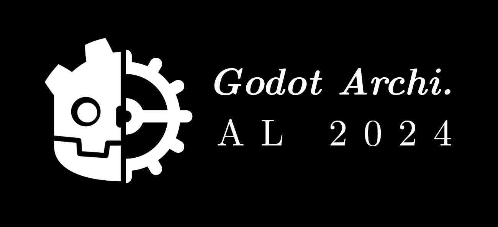
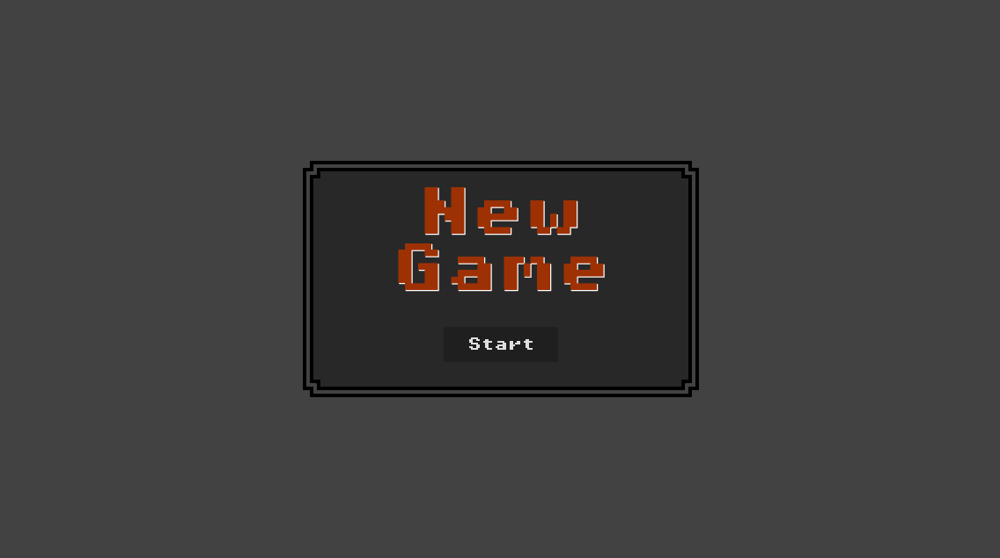
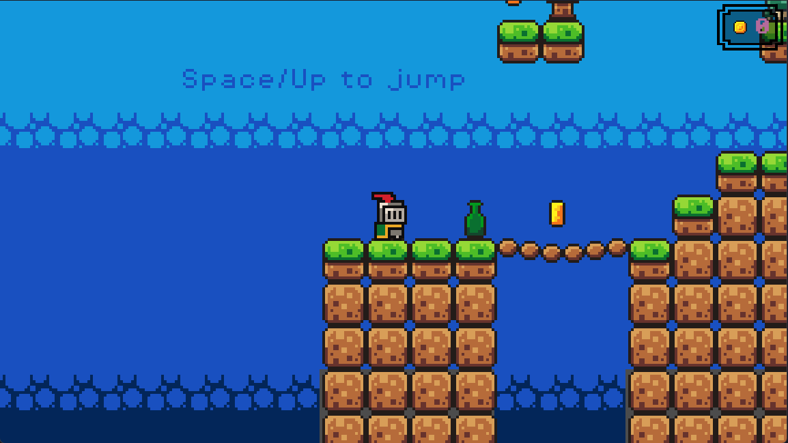
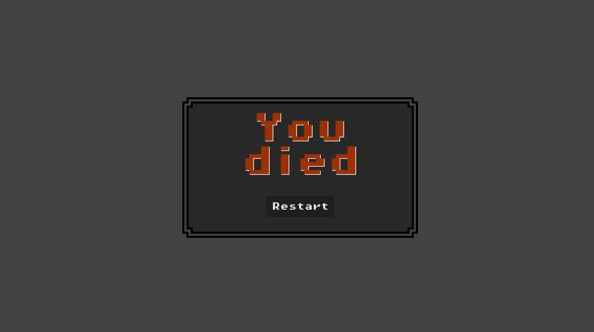

# FYC - Godot : Une approche architecturale

## Introduction

Ce support de cours a pour but de présenter une approche architecturale pour le développement de jeux vidéo avec le moteur Godot. Il est destiné à des développeurs ayant déjà une certaine expérience avec le moteur et qui souhaitent structurer leur code de manière plus formelle.

## Prérequis

Disclaimer : Ce cours n’est pas un cours de game design ! La vision de ce cours est plus large que de simplement créer un jeu vidéo, bien que le jeu vidéo soit un médium efficace pour retranscrire les compétences que vous obtiendrez à l’issue de ce cours.

Ce cours est destiné à des apprenants intermédiaires avec des bases solides en programmation objet et en algorithmie de manière générale.

- Télécharger Godot ici : https://godotengine.org/download/windows/
- Maîtrise des notions de base en programmation (variables, types de données, opérateurs, etc.).
- Maîtrise des notions de programmation objet (classes, relations, contraintes, etc.).
- Maîtrise des notions de base en programmation (fonctions, boucles, structures conditionnelles, etc.).

## Objectifs Pédagogique

À la fin de ce cours, vous serez capable de :

- Construire un projet Godot.
- Maîtrise de la logique objet de Godot et Gdscript.
- Résoudre des problèmes de programmation courants à l’aide de design patterns.
- Appliquer les principes SOLID et les design patterns adéquats à votre projet pour en garantir la robustesse et la maintenabilité.
- Exporter un projet Godot multiplateforme.
- Tester et Déployer un projet.

## Images

